# Psych Bot

### Navigation
- [Project Setup](#project-setup)
- [Project Description](#project-description)
- [Project Documentation](#project-documentation)
- [Unit Tests](#unit-tests)
- [Features by Branch](#features-by-branch)
- [Dialogue](#dialogue)
- [Assignment 3 New Features](#assignment-3-new-features)
- [Data Flow Diagrams](#data-flow-diagrams)
- [Project Demo](#project-demo)
- [Contributors](#contributors)
- [Presentation](#presentation)

## Project Setup

***Pre-requisites*** - Install the latest version of Python on your computer (Python3 is strongly recommended),
and the package management system (PIP).
After cloning the repository to your computer, follow these steps to launch the program:

**Step 1:** Open the repository in your IDE ([Visual Studio Code](https://visualstudio.microsoft.com/vs/) is recommended).  
&nbsp;  
### **For Windows**  
&nbsp;

**Step 2:** Open your Powershell command line tool.

**Step 3:** Create a virtual environment by running the following command:

```bash
python -m venv venv 
```
**Step 4:** Run a virtual environment by running the following command:
```bash
 ./venv/Scripts/activate.ps1
```
**Step 5:** Run the following to command to install all necessary dependecies:
```bash
pip install -r requirements.txt
```  
**Step 6:** Start the program by running this command:
```bash
python app.py
```
&nbsp; 

### **For Unix Based Systems**  
&nbsp;  
**Step 2:** Open a terminal in your VSCode by going to ***Terminal > New Terminal***  
**Step 3:** Run the following to command to install all necessary dependecies:
```bash
pip install -r requirements.txt
```  
**Step 4:** Start the program by running this command:
```bash
python3 app.py
```
&nbsp; 

## Project Description
The project was created for the UBC Okanagan third year level course.

**Psych Bot's** goal is to give the user psychological advice*. This bot serves as an interactive conversational agent that takes the user's input (a sentence) and outputs an appropriate response. As this assignment does not require Machine Learning implementation, the chatbot may provide a reply that may not relate to the user's prompt.


*For **legal** reasons, neither the bot nor developers are certified to provide medical help.


## Project Documentation
- [Project Plan Document](https://github.com/KentonMewling/Psych-Bot/blob/main/docs/Assignment2_Project_Plan.pdf)
- [Word Breakdown Structure](https://github.com/KentonMewling/Psych-Bot/blob/main/docs/WBS.png)
- [Gantt Chart](https://github.com/KentonMewling/Psych-Bot/blob/main/docs/Gantt%20Chart.png)
- [Network Graph/Branch & Commits](https://github.com/KentonMewling/Psych-Bot/network)

## Unit Tests

### **For Windows**
&nbsp;

**Step 1:** Open your Powershell command line tool.

**Step 2:** To run the unit test in the Bot class run this command:
```bash
python tests/bot.test.py 
```
**Step 3:** To run the unit test in the FileReader class run this command:
```bash
python tests/fileReader.test.py
```
&nbsp;
### **For Unix Based Systems**
&nbsp;

**Step 1:** Open a terminal in your VSCode by going to ***Terminal > New Terminal*** 

**Step 2:** To run the unit test in the Bot class run this command:
```bash
python3 tests/bot.test.py
```
**Step 3:** To run the unit test in the FileReader class run this command:
```bash
python3 tests/fileReader.test.py
```
&nbsp;
## Features by Branch


## Dialogue


## Assignment 3 New Features

### GUI ###
 
 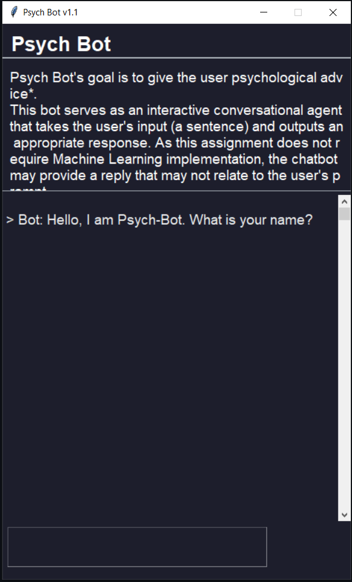

### Synonym Recognition ###

**>The bot is capable of detecting the synonyms of the words based on the user input**

<table>
  <tr>
    <td>Word : Family</td>
     <td>Word : Folk</td>
  </tr>
  <tr>
    <td>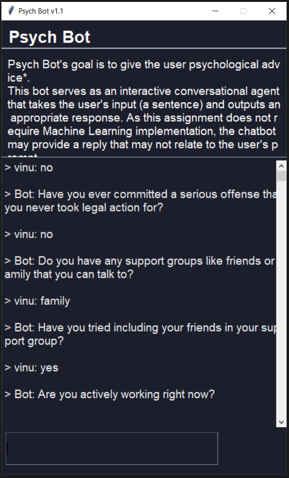</td>
    <td>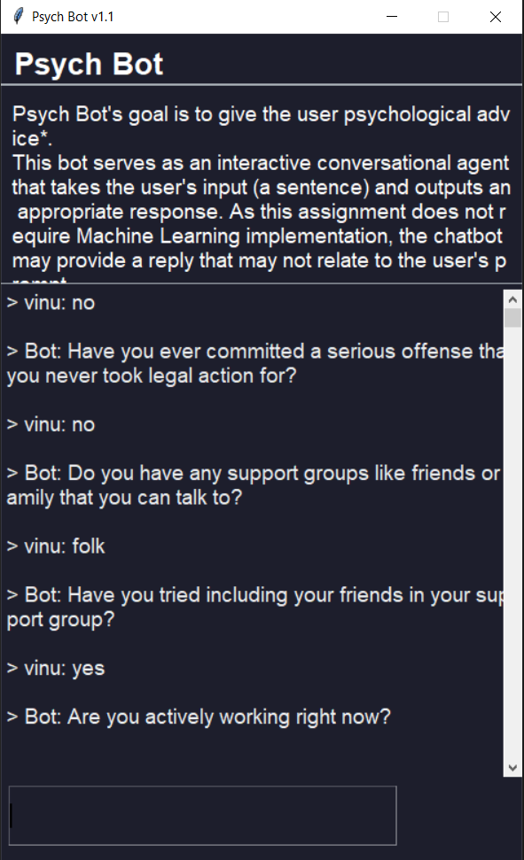</td>
  </tr>
 </table>
 
 ### POS Tagging ###
 
 **>Replying with a question or a therapy word (anxiety / depression / suicide) 
   Results in no more scheduled time**
   
 **>Replying with just a question 
   Results in the system not being able to help**
   
 **>Replying with anything else 
   Results in the system concluding the session**
 
 <table>
  <tr>
    <td>Question/Therapy words</td>
    <td>Just Question</td>
    <td>Other</td>
  </tr>
  <tr>
    <td>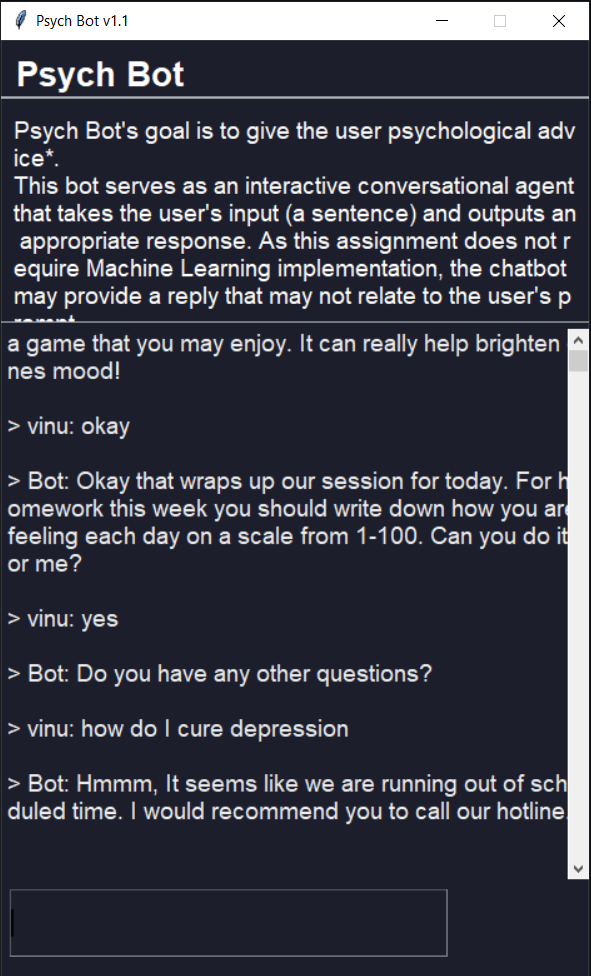</td>
    <td>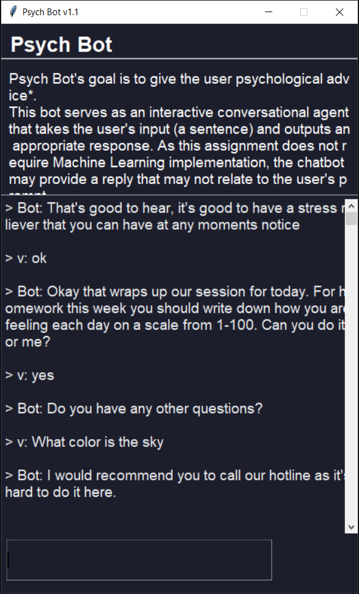</td>
    <td>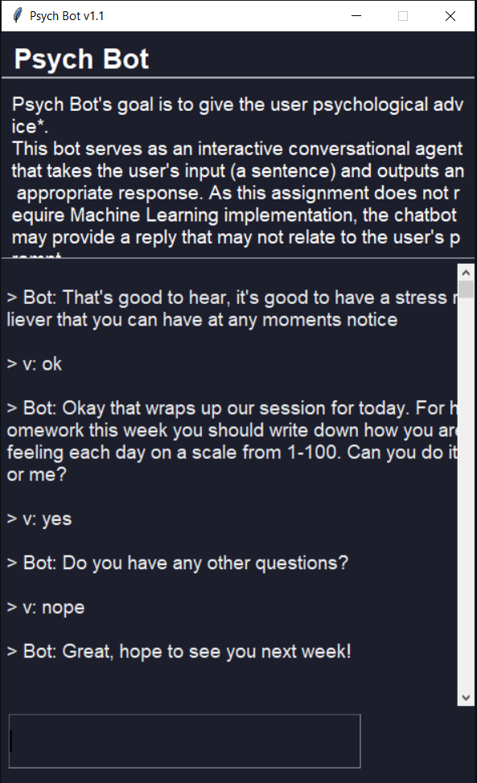</td>
  </tr>
 </table>
 
 ### Sentiment Analysis ###
 
 **>The system decides if the response is either Positive or Negative**
 
 <table>
  <tr>
    <td>Negative</td>
    <td>Positive</td>
  </tr>
  <tr>
    <td>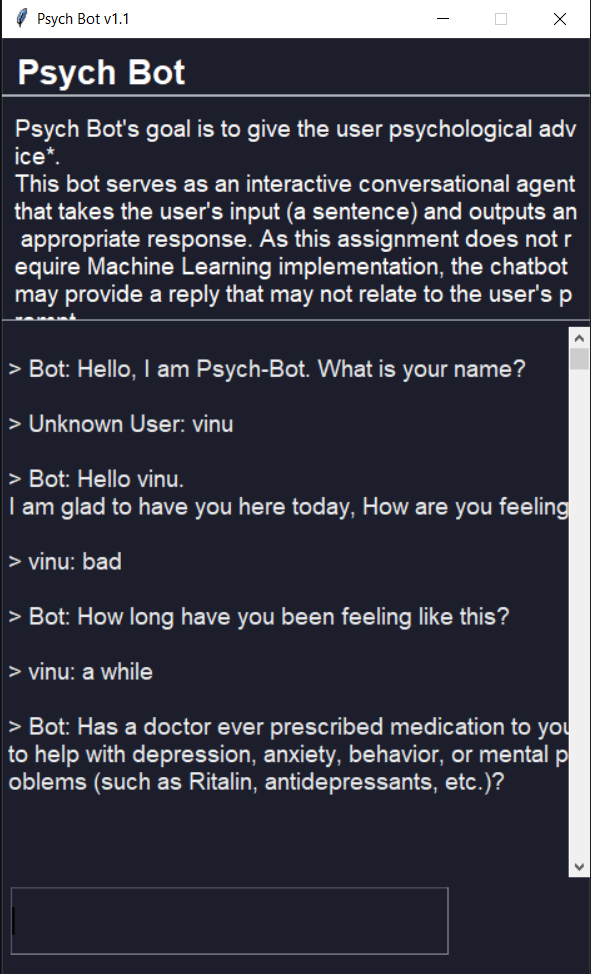</td>
    <td>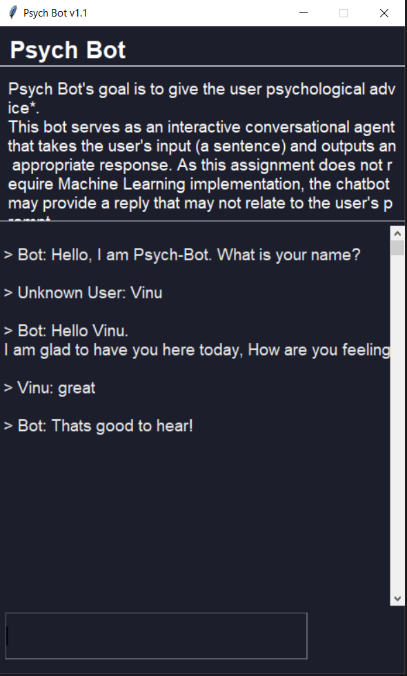</td>
  </tr>
 </table>
 
 ## Data Flow Diagrams ##
 
 ### Data Flow Diagram level 0 ###

This is a level 0 data flow diagram. It shows the abstract relationships between the user, our graphical user inferface and the bot interact. 

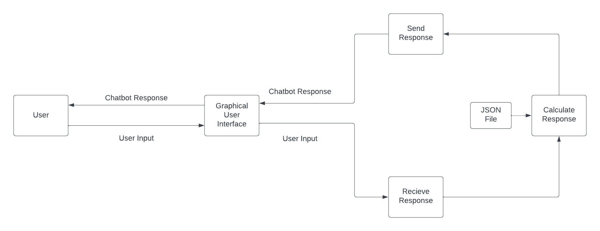
 
 ### Data Flow Diagram level 1 ###


This is a level 1 data flow diagram. It shows a more specific relationship between the user, our graphical user inferface and the bot. This includes the process in which the bot recieves data from the GUI, processes that data through the Porterstemmer as well as many language toolkits to improve the response.

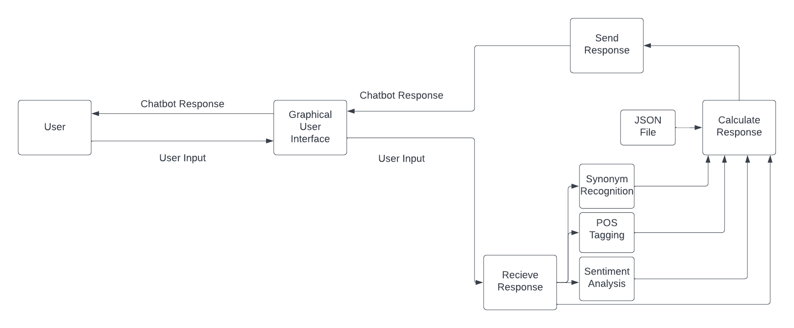

## Project Demo 

**A2: Sample Demo #1**

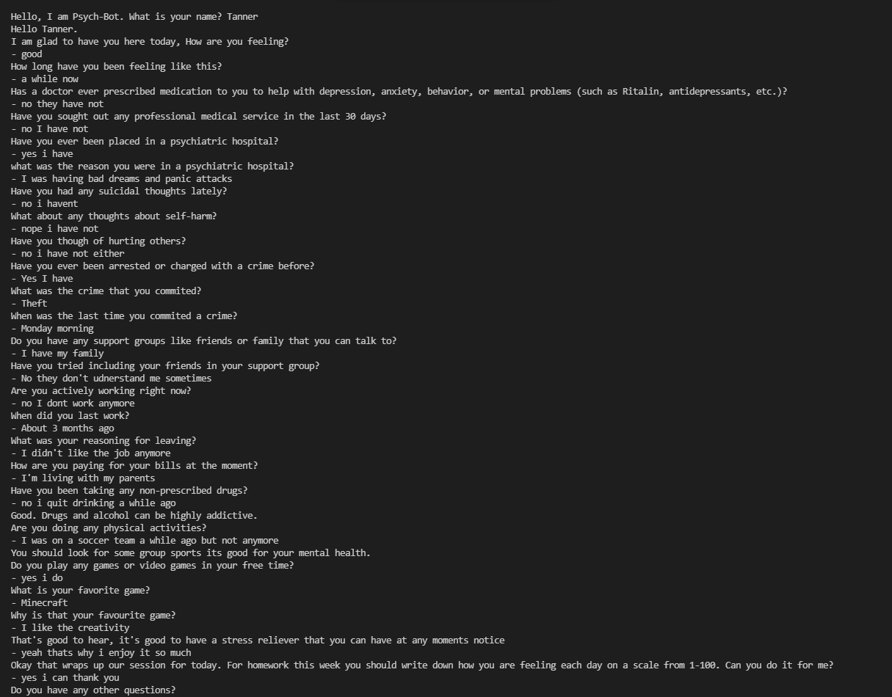


**A2: Sample Demo #2**

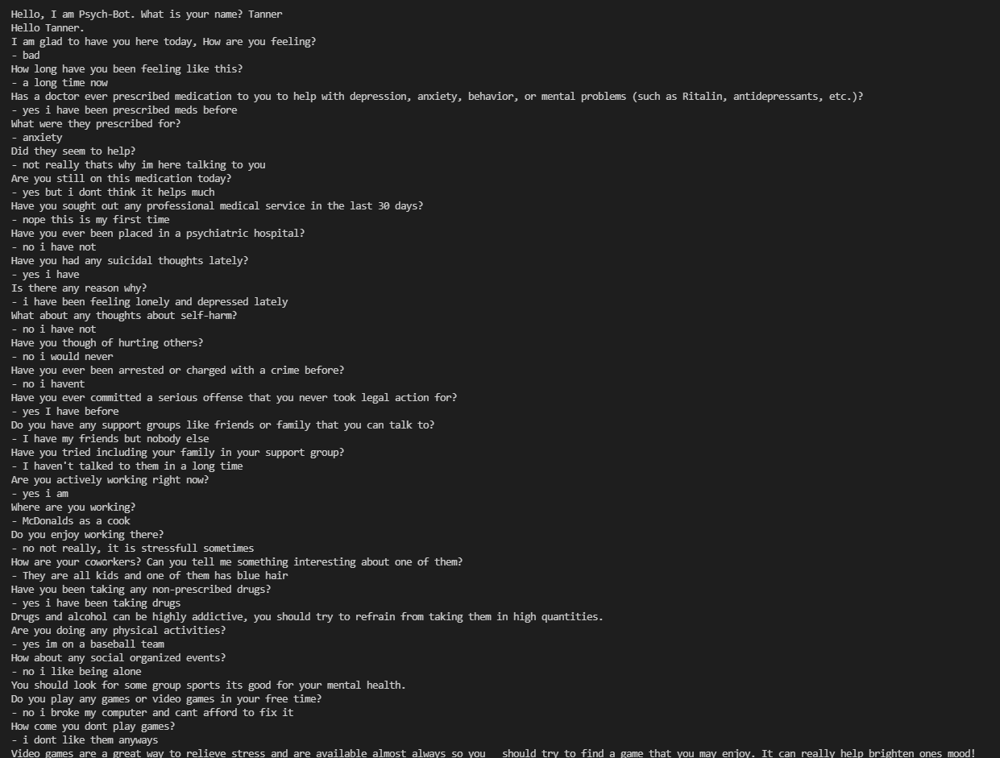


**A2: Sample Demo #3**

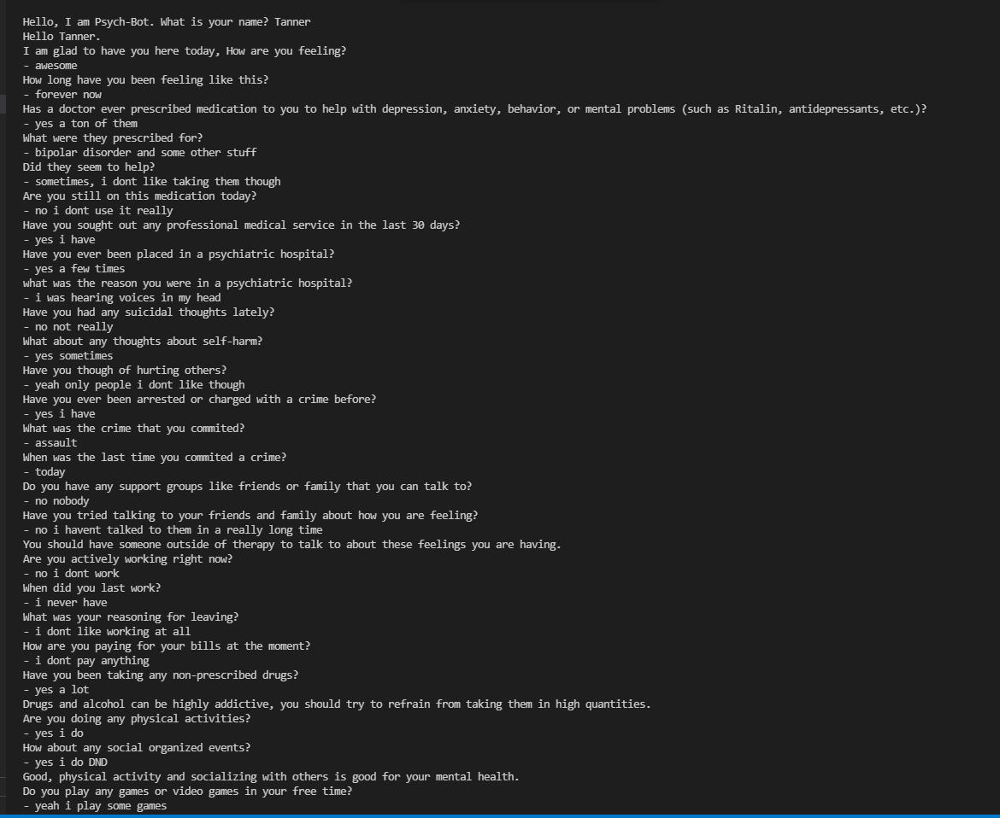


## Presentation 
https://drive.google.com/file/d/1d1YoKrsMo2QLvyRmTXqykamdag-MjdqK/view

## Contributors

- [@d3li0n](https://github.com/d3li0n) - GUI, Automated Unit Testing.
- [@KentonMewling](https://github.com/KentonMewling) - Automated Unit Testing, Presentation.
- [@RyanG418](https://github.com/RyanG418) - Documentation, Presentation.
- [@vinui409](https://github.com/vinui409) - Documentation, Presentation.
- [@OKThomas1](https://github.com/OKThomas1) - Core Development. 
